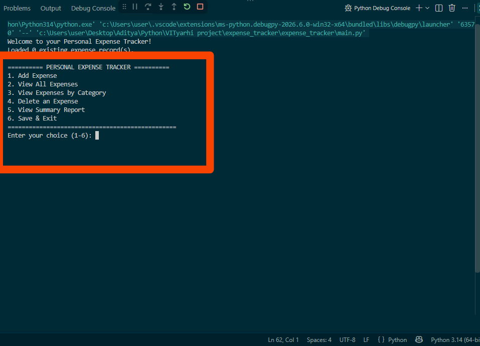
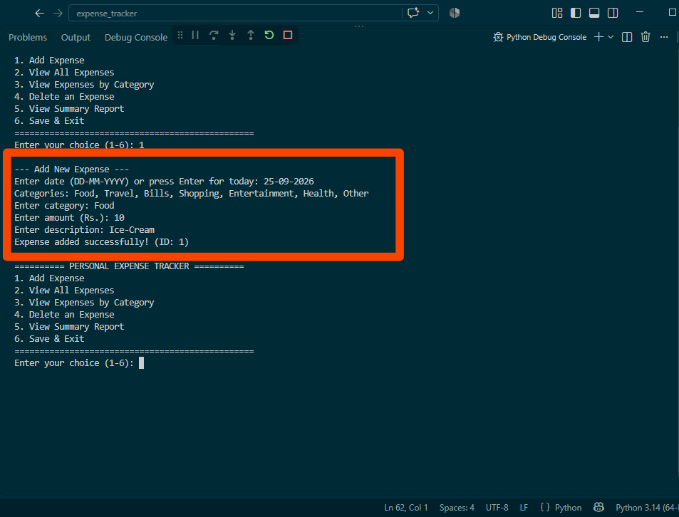
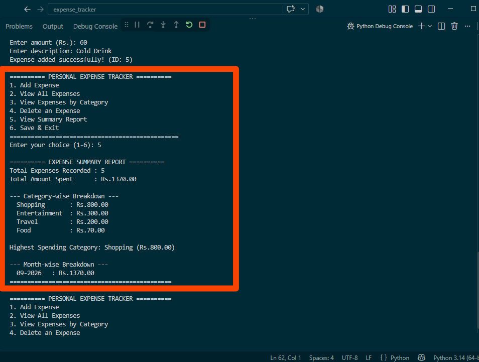

#Track Your Personal Expenses.

A command line application is a simple menu driven application created in Python.
Monitor what you spend. Categorize what you spend & see summary reports.


#Summary.

Putting down your day-to-day expenses manually is quite tedious, and people do lose track pretty easily.
of where they are spending their money each month This project offers a lightweight solution.
A command-line utility that enables a user to enter and retrieve his/her expenses.
Create a summary report showing total spending, category-wise breakdown, and more.
and monthly breakdown all without a database or an internet connection
Link

#Attribute

- Add an expense with date, category, amount and description.
- Display all the costs you have recorded in a table.
- View and filter expenses by a category.
- Remove an expense using its identification number.
- Produce a summary report:
- Total money spent.
- Breakdown of Spending by Category (highest to lowest).
- The category with the highest expenditure.
- Spending breakdown by month.
- Data is automatically saved to a CSV file so it persists between runs.
- Ensure validation of all fields including amount, date, category and description.
- A graceful way of handling errors (invalid input never crashes).

#Technology / Tool used.

- The solution is implemented in Python 3 and requires only standard CSV, OS and DateTime libraries to run properly.
- Storage CSV file at `data/expenses.csv`
- Git and GitHub are version control systems.

#Organizational Chart

```.
expenses_tracker/.
│.
source main.py serves as the key entry point, which gives a menu-driven cli.
modules subdirectory
init file
The expense_manager.py contains logic to add, view and delete expenses.
This file helps in loading and saving expenses in csv.
The detailed analysis and summary of the data is done by the report generator.
output is "─ utils.py # Input validation helpers" 
tests directory
Init .py file
test_expense_manager.py
test file handler 
test_report_generator.py
data folder
This file is automatically created and stores expense records.
README file
statement file
```.

#Procedure for Installation and Execution.

1. Be certain that Python 3.7 or higher is installed:
```.
check python version
```.
2. Make a copy of this repository
```.
git clone <https://github.com/aditya26bce10100/expense_tracker.git>
cd expense_tracker
```.
3. Execute the application:
```.
Execute python3 main.py.
```.
4. You can add, view, delete expenses, or delete accounts using the on-screen menu (options 1-6)
Read the summary report.

There is no need to install any other packages; the project requires only.
Standard library of Python.

#Testing Instructions.

#Auto-Unit Testing.

Cores logic of the project has automated unit tests (13). 
Python's expense_manager, file_handler, report_generator.
The `unittest` module is built-in and has no dependencies.

Execute all tests from a project’s root folder
```.
Run all unit tests in tests subdirectory
```.

For a more detailed output.
```.
Run Unit Tests for Python Script.
```.

The tests pertaining to the `file_handler` should never be running into a temporary file.
affects your actual `data/expenses.csv` file.

#Testing manually.
1. Execute the command: python3 main.py.
2. Select option `1` and add 3-4 expenses across various categories.
Such as food, travel, bills.
3. Please select option number two that says ‘All expenses appear correctly.
4. Select option three then filter by one Category to check if filtering works.
5. Select 5 to confirm that the report summary total is the same as yours.
6. Select option `4` and delete an expense by id; then re-check with option `2`.
7. Make use of invalid inputs like negative amounts, blank descriptions, and letters rather than numbers in order to ensure that the program acknowledges the error and enables users repeat their action.
crashing.
8. Opt for `6` as your exit option and rerun the program.
Confirm your data has been saved? 
And resumes its function.

## Screenshots

### Main Menu


### Adding an Expense


### Summary Report


## Author

Aditya Garg
Reg No.: 26BCE10100
Submitted as part of the VITyarthi "Build Your Own Project" evaluation for
Introduction to Problem Solving and Programming (B.Tech First Year).
